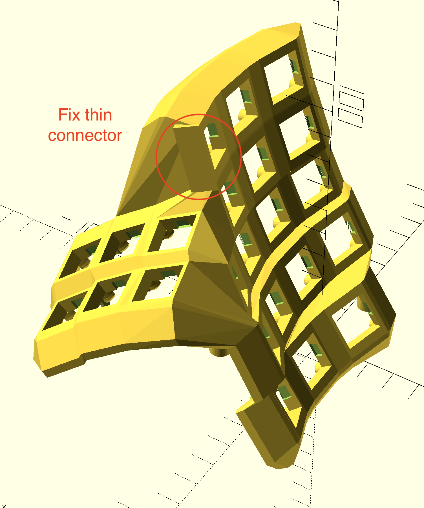
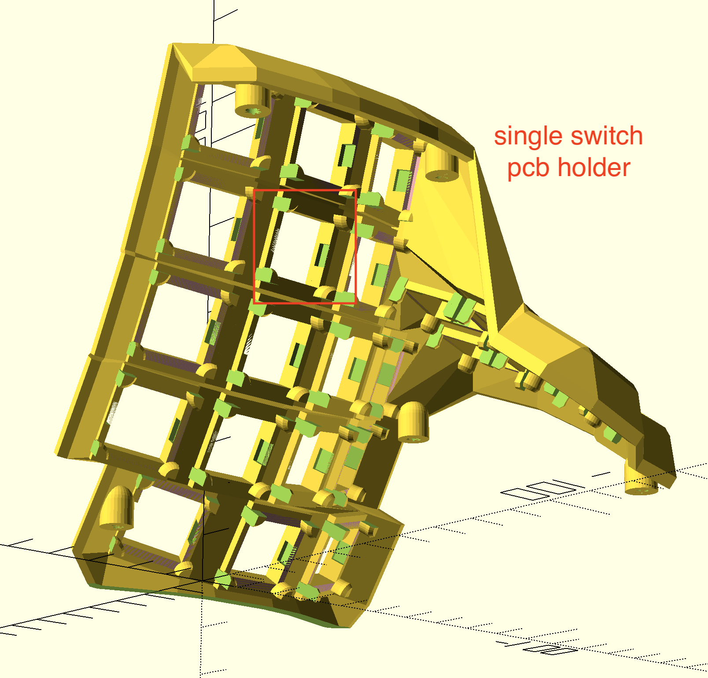
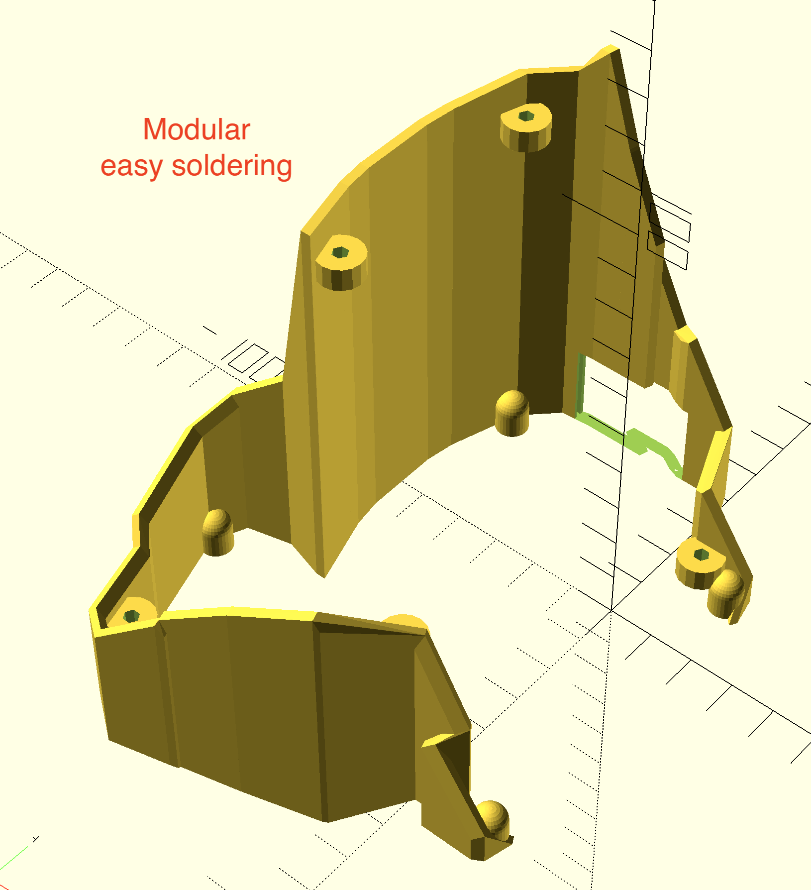

<!-- PROJECT SHIELDS -->
[![Contributors][contributors-shield]][contributors-url]
[![Forks][forks-shield]][forks-url]
[![Stargazers][stars-shield]][stars-url]
[![Issues][issues-shield]][issues-url]
[![License][license-shield]][license-url]

<!-- PROJECT LOGO -->
 

  <h3 align="center">Dactyl Manuform Vertical Modular 4x5</h3>

  

    Modular 4x5 Vertical Dactyl Manuform.
     
  

<!-- ABOUT THE PROJECT -->
## Features

[![Dactyl Manuform Vertical Modular 4x5][product-screenshot]](https://github.com/neutronbyte/dactyl-manuform-vertical-modular-4x5)

+ 4x5 layout. 
+ Add Single switch PCB holder
+ Fix thumb location
+ Change pro micro hole location
+ Fix screw location 
- The use of sidenubs can be disabled. Sidenub should be disabled if you use Kailh, and Outemu. If you use Cherry MX, Gateron or Zealios switches, you can enable the sidenubs.
- Toggle for outer column between using 1.5u sized keys and 1u sized keys.
- If enabled, the rows which use 1.5u sized keys can be specified.
- Toggle for an extra row of keys for the outer column(s).
- Toggle for an extra inner column before the thumbcluster with (nrows-2) rows.
- Toggle between using the default thumb cluster, the mini thumb cluster designed by [l4u](https://github.com/l4u/dactyl-manuform-mini-keyboard), and a new thumb cluster.
- This new thumb cluster uses the same keycaps as the default, but is more compact. The thumb only has to move one position left or right from its neutral position to reach all the keys. 
- Removable controller board / TRRS jack holder as a separate part. This holder is then friction fit into a cutout on the back wall of the case. Designed for common TRRS breakout boards. 
- Models for both pro-micro and elite-c holders in the [things/](things/) directory. 

## Generate OpenSCAD and STL models

1. Run `lein generate` or `lein auto generate`
2. This will regenerate the `things/*.scad` files
3. Use OpenSCAD to open a `.scad` file.
4. Make changes to design, repeat `load-file`, OpenSCAD will watch for changes and rerender.
5. When done, use OpenSCAD to export STL files

<!-- CONTRIBUTING -->
## Contributing

Contributions are what make the open source community such an amazing place to be learn, inspire, and create. Any contributions you make are **greatly appreciated**.

<!-- LICENSE -->
## License

Copyright © 2015-2018 Matthew Adereth, Tom Short and Leo Lou

The source code for generating the models is distributed under the [GNU AFFERO GENERAL PUBLIC LICENSE Version 3](LICENSE).

The generated models are distributed under the [Creative Commons Attribution-ShareAlike 4.0 International (CC BY-SA 4.0)](LICENSE-models).

<!-- CONTACT -->
## Contact

Neutron Byte - neutronbyte@gmail.com

Project Link: [https://github.com/neutronbyte/dactyl-manuform-vertical-modular-4x5](https://github.com/neutronbyte/dactyl-manuform-vertical-modular-4x5)

<!-- MARKDOWN LINKS & IMAGES -->
<!-- https://www.markdownguide.org/basic-syntax/#reference-style-links -->
[contributors-shield]: https://img.shields.io/github/contributors/neutronbyte/repo.svg?style=for-the-badge
[contributors-url]: https://github.com/neutronbyte/repo/graphs/contributors
[forks-shield]: https://img.shields.io/github/forks/neutronbyte/repo.svg?style=for-the-badge
[forks-url]: https://github.com/neutronbyte/repo/network/members
[stars-shield]: https://img.shields.io/github/stars/neutronbyte/repo.svg?style=for-the-badge
[stars-url]: https://github.com/neutronbyte/repo/stargazers
[issues-shield]: https://img.shields.io/github/issues/neutronbyte/repo.svg?style=for-the-badge
[issues-url]: https://github.com/neutronbyte/repo/issues
[license-shield]: https://img.shields.io/github/license/neutronbyte/repo.svg?style=for-the-badge
[license-url]: https://github.com/neutronbyte/repo/blob/master/LICENSE.txt
[product-screenshot]: images/1.png